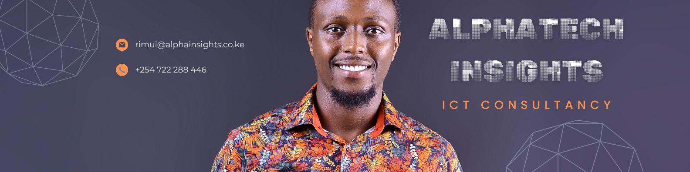

# 

Source code for my personal portfolio, alphainsights.co.ke

[](https://musabhassan.com)

### Source Information

This website is built with

- [SvelteKit (Frontend Framework)](https://kit.svelte.dev/)
- [Slickscroll (Scroll Effects)](https://github.com/Musab-Hassan/slickscrolljs)
- [Anime (Animations)](https://github.com/juliangarnier/anime)
- [Three.js (3D Effects)](https://github.com/mrdoob/three.js/)
- [Firebase (Hosting)](https://firebase.google.com/docs/hosting)

This is the source for version 2+. Version 1.0, the one built with jQuery is in the [v1 branch](https://github.com/Musab-Hassan/musabhassan.com/tree/v1).

### Developing

The site is just a regular SvelteKit project, with ssr disabled.

For development, start the vite development server:

```bash
npm run dev
```

_Note: Due to migration from Rollup, HMR breaks the site. You have to do a full reload if you modify any components or TS files._

For production, build the site:

```bash
npm run build
```

### License

Mozilla Public License 2.0 License.
